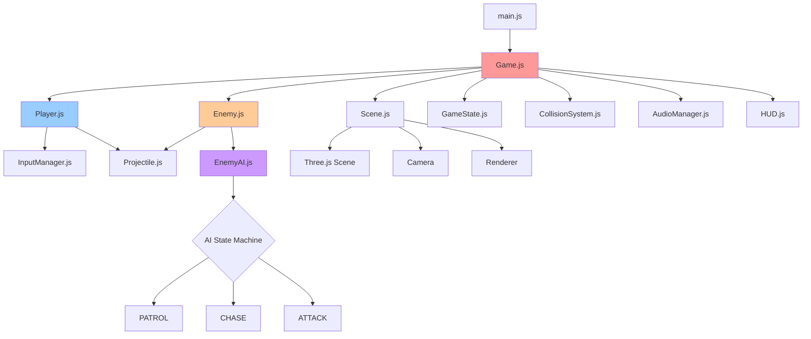
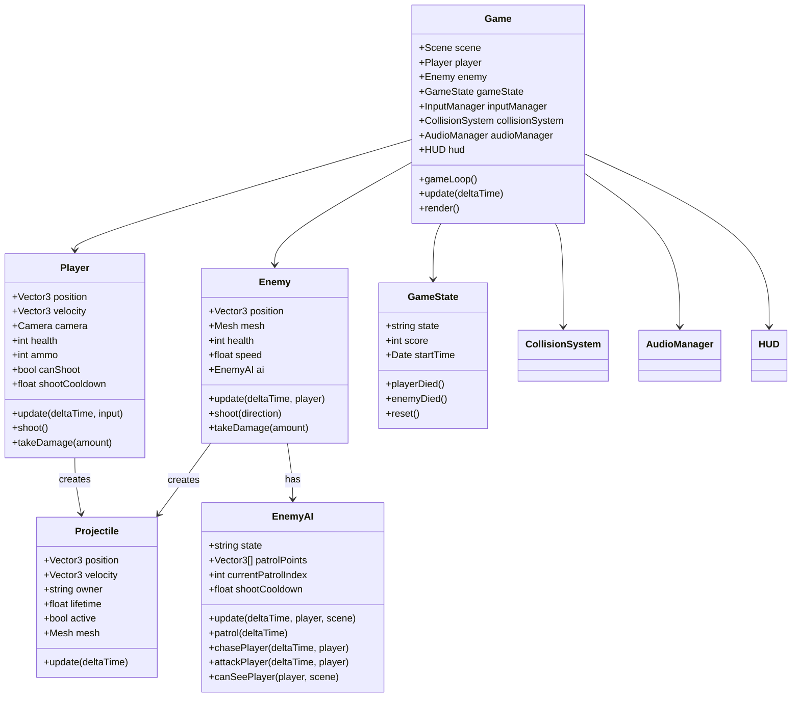
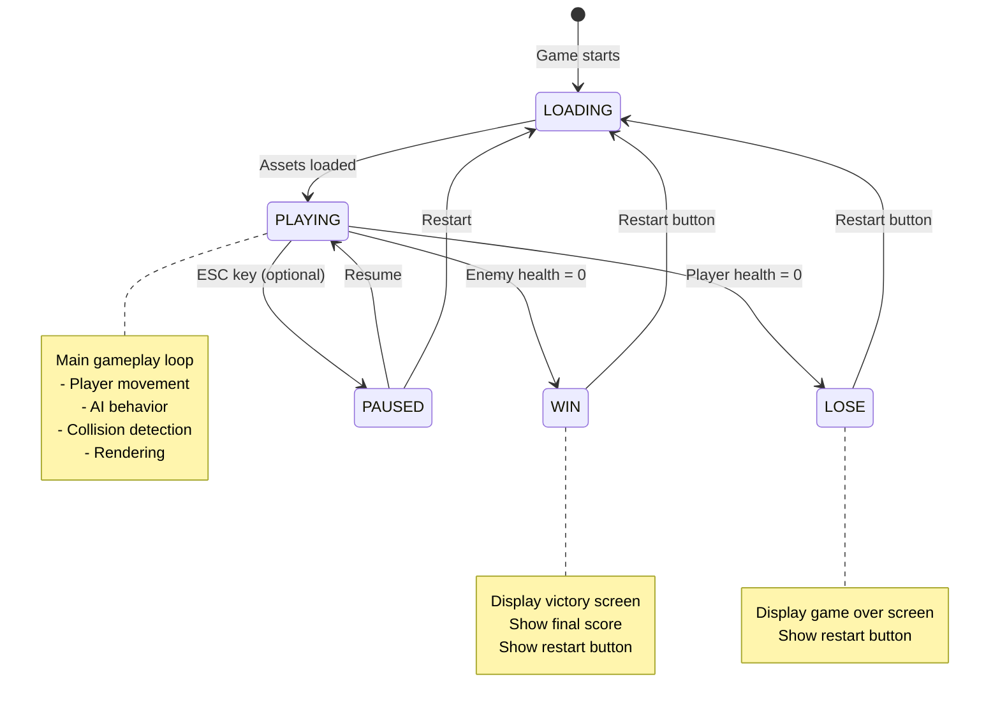
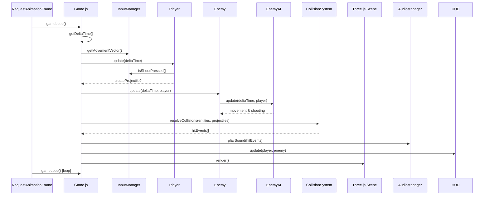
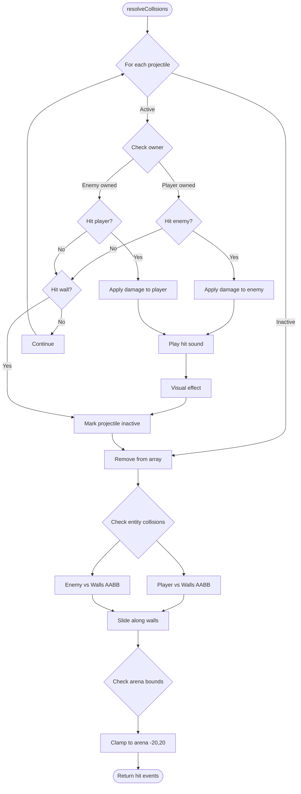
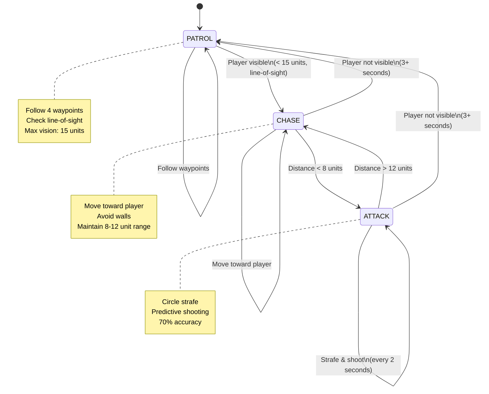

# 3D First-Person Shooter Arena Game

## Context

Building a browser-based 3D first-person shooter game from scratch in an empty project directory. The game features a single-player arena where the player battles one computer-controlled opponent. This is a complete, playable web game with immersive visuals, sound effects, and intuitive controls.

**User Preferences:**

- Controls: Arrow keys only (no mouse look) - up/down for forward/back, left/right for strafing
- Visual Style: Textured graphics with quality lighting
- Audio: Include sound effects for shooting, hits, and game events

## Technology Stack

- **3D Engine:** Three.js (WebGL rendering)
- **Build Tool:** Vite (fast dev server, zero config)
- **Language:** JavaScript ES6+
- **Physics:** Custom AABB collision detection (lightweight)
- **AI:** Finite State Machine (patrol, chase, attack)
- **Audio:** Web Audio API

## Project Structure

```
simple-space-shooter/
├── index.html              # Main entry point
├── package.json            # Dependencies (three.js, vite)
├── vite.config.js          # Vite configuration
├── style.css               # UI styling
├── src/
│   ├── main.js             # Game initialization
│   ├── game/
│   │   ├── Game.js         # Main game loop orchestration
│   │   ├── Scene.js        # Three.js scene, arena, lighting
│   │   └── GameState.js    # Health, win/lose conditions
│   ├── entities/
│   │   ├── Player.js       # First-person controller
│   │   ├── Enemy.js        # Enemy entity
│   │   └── Projectile.js   # Bullets
│   ├── systems/
│   │   ├── InputManager.js # Keyboard input handling
│   │   ├── CollisionSystem.js # AABB collision detection
│   │   └── AudioManager.js # Sound effects
│   ├── ai/
│   │   └── EnemyAI.js      # FSM behavior (patrol/chase/attack)
│   └── ui/
│       └── HUD.js          # Health bars, ammo, crosshair
└── public/
    └── sounds/             # Audio files (.mp3 or .ogg)
```

## System Architecture Diagram



## Entity Class Diagram



## Game State Flow



## Implementation Plan

### Phase 1: Project Setup & Core Infrastructure

**1.1 Initialize Project**

- Create `package.json` with dependencies: `three` (^0.160.0), `vite` (^5.0.0)
- Create `vite.config.js` for build configuration
- Set up dev server scripts: `dev`, `build`, `preview`

**1.2 HTML & CSS Foundation**

- Create `index.html` with canvas container, HUD overlay, game-over screen
- Create `style.css` with:
  - Full-screen canvas (no margins/padding)
  - HUD elements (health bar bottom-left, ammo bottom-right, crosshair center)
  - Game-over overlay (translucent background, centered text, restart button)

**1.3 Scene Setup** (`src/game/Scene.js`)

- Initialize Three.js: `WebGLRenderer`, `PerspectiveCamera` (FOV 75°), `Scene`
- Create arena:
  - Floor: 40x40 plane with grid texture
  - Walls: 4 surrounding walls (height 5 units) with concrete/metal texture
  - Cover objects: 4-5 boxes/cylinders for tactical gameplay
- Lighting:
  - Ambient light (soft fill, 0x404040)
  - Directional light (sun-like, 0xffffff, from above)
  - Optional point lights for atmosphere
- Background: Gradient skybox or solid color

**1.4 Game Loop** (`src/game/Game.js`)



- Initialize all systems (Scene, Player, Enemy, InputManager, CollisionSystem, AudioManager)
- Implement fixed timestep loop:
  - `update(deltaTime)`: Update entities, check collisions, update game state
  - `render()`: Render Three.js scene
  - `gameLoop()`: RequestAnimationFrame with delta time calculation
- Handle window resize events

### Phase 2: Player System

**2.1 Input Manager** (`src/systems/InputManager.js`)

- Track keyboard state for arrow keys and spacebar
- Event listeners: `keydown`, `keyup`
- Methods:
  - `isKeyPressed(key)`: Check if specific key is down
  - `getMovementVector()`: Calculate movement direction from arrow keys
  - `isShootPressed()`: Check spacebar state

**2.2 Player Controller** (`src/entities/Player.js`)

- First-person camera positioned at eye level (1.6 units above ground)
- Movement:
  - Arrow up/down: Forward/backward movement (5 units/sec)
  - Arrow left/right: Strafing movement (5 units/sec)
  - Camera rotation: Fixed forward direction (no mouse look)
  - Apply velocity with delta time for smooth, frame-independent movement
- Shooting:
  - Spacebar creates `Projectile` along camera forward vector
  - Cooldown: 0.5 seconds between shots
  - Ammo: 30 rounds (infinite for MVP, can add reload later)
  - Muzzle flash effect (brief light pulse)
- Properties: `health` (100), `ammo` (30), `position`, `velocity`
- Collision with walls prevents movement (slide along walls)

**2.3 Projectile System** (`src/entities/Projectile.js`)

- Visual: Small yellow sphere (0.1 radius) with emissive material
- Physics:
  - Speed: 20 units/second
  - Lifetime: 3 seconds (auto-destroy)
  - Trail effect (optional): Line renderer or particle system
- Owner tracking: 'player' or 'enemy' (prevent self-damage)
- Damage: 20 per hit

### Phase 3: Combat System

**3.1 Collision Detection** (`src/systems/CollisionSystem.js`)



- AABB (Axis-Aligned Bounding Box) collision for entities vs walls
- Sphere collision for projectiles vs entities
- Arena bounds enforcement: Keep entities within (-20, 20) in X/Z
- Methods:
  - `checkAABB(entity1, entity2)`: Box-box collision
  - `checkProjectileHit(projectile, target)`: Sphere-box collision
  - `checkWallCollision(entity, arena)`: Prevent leaving arena
  - `resolveCollisions(entities, projectiles)`: Apply damage, remove dead projectiles
- Wall sliding: Project movement vector when collision detected

**3.2 Damage System**

- Projectile hit applies 20 damage to target
- Health reaches 0 triggers death
- Player death: Transition to LOSE state
- Enemy death: Transition to WIN state
- Visual feedback: Flash red material on hit (200ms duration)

### Phase 4: Enemy AI

**4.1 Enemy Entity** (`src/entities/Enemy.js`)

- Visual: Red box (1x2x1) with Phong material for lighting
- Starting position: Opposite corner from player
- Properties: `health` (100), `speed` (3 units/sec), `shootCooldown` (2 sec)
- Methods:
  - `update(deltaTime, player, scene)`: Call AI update
  - `takeDamage(amount)`: Reduce health, check death
  - `shoot(direction)`: Create projectile toward player

**4.2 AI State Machine** (`src/ai/EnemyAI.js`)



- **PATROL State:**
  - Follow 4 waypoints around arena perimeter
  - Move to next waypoint when close (< 1 unit)
  - Continuously check line-of-sight to player (raycasting)
  - Transition to CHASE when player visible (within 15 units, no wall occlusion)

- **CHASE State:**
  - Move directly toward player (pathfinding: direct line, avoid walls)
  - Maintain engagement distance (8-12 units optimal)
  - Transition to ATTACK when within 8 units
  - Transition to PATROL if player not visible for 3+ seconds

- **ATTACK State:**
  - Strafe movement (circle around player, randomized direction changes)
  - Shoot every 2 seconds with predictive aim:
    - Calculate time-to-impact based on distance
    - Lead target: Aim where player will be (account for player velocity)
    - 70% accuracy (slight random offset)
  - Transition to CHASE if player moves beyond 12 units

- **Line-of-Sight Detection:**
  - Raycaster from enemy position to player position
  - Check if ray intersects walls (occlusion)
  - Max vision range: 15 units
  - Field of view: 360° (always aware when in range and visible)

- **Wall Avoidance:**
  - Raycast in movement direction
  - If obstacle within 2 units, adjust direction (turn 45° left or right)
  - Stuck detection: If position unchanged for 2 seconds, pick random direction

### Phase 5: Game State & UI

**5.1 Game State Manager** (`src/game/GameState.js`)

- States: `PLAYING`, `WIN`, `LOSE`, `PAUSED`
- Track: `score`, `startTime`, `currentState`
- Methods:
  - `playerDied()`: Set to LOSE, show game over screen
  - `enemyDied()`: Set to WIN, add score, show victory screen
  - `reset()`: Reset all state, respawn entities, return to PLAYING
  - `pause()`: Freeze game loop (optional)

**5.2 HUD System** (`src/ui/HUD.js`)

- Health bar (player): Bottom-left, red gradient, 200x20px, shows percentage
- Ammo counter: Bottom-right, white text, "Ammo: X/30" format
- Crosshair: Center screen, white cross or dot, 20x20px
- Enemy health bar: Top center when enemy visible, red bar above enemy in 3D space
- Methods:
  - `update(player, enemy)`: Refresh all HUD elements every frame
  - `showGameOver(won)`: Display win/lose screen with final score and restart button

**5.3 Game Over & Restart**

- Overlay div with translucent background (rgba(0,0,0,0.8))
- Victory text: "You Win! Score: X" (green)
- Defeat text: "Game Over" (red)
- Restart button: Calls `gameState.reset()`, hides overlay, restarts game loop
- Optional: Display time survived and accuracy stats

### Phase 6: Audio & Polish

**6.1 Audio Manager** (`src/systems/AudioManager.js`)

- Web Audio API for sound playback
- Sound effects needed:
  - Shoot sound (player): Laser/gun sound
  - Shoot sound (enemy): Different pitch/tone to distinguish
  - Hit sound: Impact effect when projectile hits
  - Game over sound: Victory fanfare or defeat tone
- Methods:
  - `playSound(soundName)`: Play audio file from public/sounds/
  - `setVolume(level)`: Master volume control
- Preload all sounds on game initialization
- Use free sound libraries: Freesound.org, ZapSplat, or generate with jsfxr

**6.2 Visual Effects**

- Muzzle flash: Brief point light at gun position when shooting (0.1 sec duration)
- Hit spark: Particle burst at projectile impact point (5-10 particles, yellow/orange)
- Projectile trail: Fading line renderer or particle trail behind bullets
- Death animation: Enemy fades out over 1 second when killed
- Screen flash: Red overlay flash when player takes damage (0.2 sec)

**6.3 Arena Textures & Materials**

- Floor: Grid texture (white lines on dark gray) for depth perception
- Walls: Concrete or metal panel texture with normal maps
- Cover objects: Metallic or concrete materials with appropriate textures
- Skybox: Gradient from dark blue (top) to lighter blue (horizon)
- All textures: Use Three.js TextureLoader, consider UV mapping

## Critical Implementation Details

### Camera Setup (Arrow Keys Only)

```javascript
// In Player.js
handleMovement(deltaTime, inputManager) {
  const moveSpeed = 5;
  const direction = new THREE.Vector3();

  if (inputManager.isKeyPressed('ArrowUp')) {
    direction.z -= 1; // Forward (relative to camera)
  }
  if (inputManager.isKeyPressed('ArrowDown')) {
    direction.z += 1; // Backward
  }
  if (inputManager.isKeyPressed('ArrowLeft')) {
    direction.x -= 1; // Strafe left
  }
  if (inputManager.isKeyPressed('ArrowRight')) {
    direction.x += 1; // Strafe right
  }

  direction.normalize().multiplyScalar(moveSpeed * deltaTime);

  // Apply camera rotation to movement direction
  direction.applyQuaternion(this.camera.quaternion);

  // Check collision before moving
  const newPosition = this.position.clone().add(direction);
  if (!collisionSystem.checkWallCollision(newPosition, arena)) {
    this.position.copy(newPosition);
    this.camera.position.copy(this.position);
  }
}
```

### Predictive AI Shooting

```javascript
// In EnemyAI.js
calculateLeadTarget(player) {
  const projectileSpeed = 20;
  const distance = this.enemy.position.distanceTo(player.position);
  const timeToImpact = distance / projectileSpeed;

  // Predict where player will be
  const leadPosition = player.position.clone().add(
    player.velocity.clone().multiplyScalar(timeToImpact)
  );

  // Add accuracy variance (70% accurate)
  const accuracy = 0.3; // 0.3 = 70% accurate (lower = more accurate)
  leadPosition.x += (Math.random() - 0.5) * accuracy * distance;
  leadPosition.z += (Math.random() - 0.5) * accuracy * distance;

  return leadPosition.sub(this.enemy.position).normalize();
}
```

### Performance Optimizations

- Object pooling for projectiles (max 50, reuse instead of create/destroy)
- Update only active entities (skip dead enemies)
- Frustum culling (Three.js automatic)
- Limit draw calls: Merge static geometry where possible
- Use instanced rendering for projectiles if count > 20

## Testing & Verification

### Manual Testing Checklist

1. **Movement**: Player moves smoothly with arrow keys, doesn't pass through walls
2. **Shooting**: Spacebar fires projectiles, cooldown works, ammo depletes
3. **Enemy AI**:
   - Patrols when player not visible
   - Chases when player spotted
   - Shoots accurately at close range
   - Doesn't get stuck on walls
4. **Combat**: Projectiles hit and deal damage, health bars update correctly
5. **Game Over**: Game ends when health reaches 0, restart works
6. **Audio**: All sounds play at appropriate times
7. **Performance**: Maintains 60 FPS on mid-range hardware
8. **UI**: HUD displays correctly, game over screen shows proper message

### Testing Commands

```bash
# Development server
npm run dev

# Production build
npm run build

# Preview production build
npm run preview
```

### Browser Testing

- Test in Chrome (primary)
- Test in Firefox (WebGL compatibility)
- Test in Safari (if available)
- Check browser console for errors

## Critical Files

1. **src/game/Game.js** - Orchestrates all systems, main game loop
2. **src/entities/Player.js** - First-person controls, shooting mechanics
3. **src/ai/EnemyAI.js** - AI state machine, line-of-sight, predictive shooting
4. **src/systems/CollisionSystem.js** - AABB collision, projectile hits
5. **src/game/Scene.js** - Three.js setup, arena creation, lighting
6. **src/systems/AudioManager.js** - Sound effect playback
7. **index.html** - Canvas container, HUD structure
8. **style.css** - UI styling, HUD positioning

## Development Timeline

- **Phase 1-2**: 2-3 hours (Setup, scene, player movement)
- **Phase 3**: 1-2 hours (Projectiles, collision detection)
- **Phase 4**: 2-3 hours (Enemy AI, combat)
- **Phase 5**: 1-2 hours (Game state, HUD, win/lose)
- **Phase 6**: 2-3 hours (Audio, visual effects, textures)
- **Total**: 8-13 hours for complete implementation

## Post-Implementation Enhancements (Optional)

- Multiple enemies with difficulty scaling
- Weapon variety (shotgun, sniper, rocket launcher)
- Power-ups (health packs, ammo boxes, shield)
- Multiple arena maps with different layouts
- Leaderboard with local storage
- Mouse look option toggle
- Mobile touch controls
